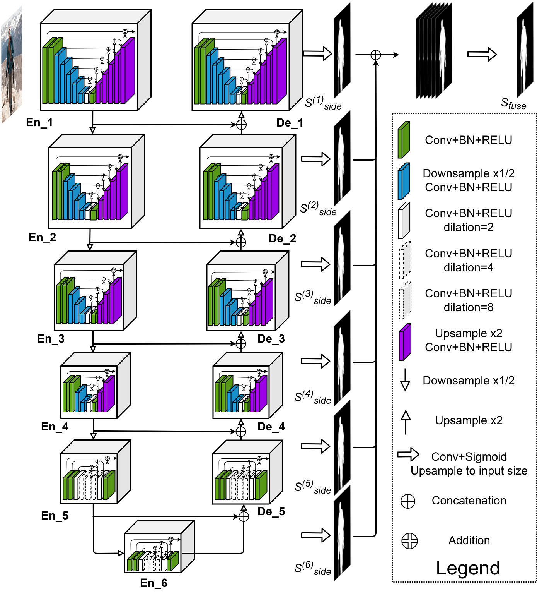

# U²Net (Tensorflow 2 / Keras)

Reimplementation of U²-Net: Going Deeper with Nested U-Structure for Salient Object Detection

* Paper: https://arxiv.org/pdf/2005.09007.pdf
* Official GitHub (Pytorch implementation): https://github.com/NathanUA/U-2-Net



# Getting Started
###Requirements

Tested with Python 3.7 and Tensorflow 2.3.

``
pip install -r requirements.txt
``

### Download Data
The model is trained on the DUTS image dataset for Salient Object Detection: http://saliencydetection.net/duts/

To download the data run the follow:
```
wget http://saliencydetection.net/duts/download/DUTS-TR.zip
wget http://saliencydetection.net/duts/download/DUTS-TE.zip
```

Next unzip the archives
```
unzip DUTS-TR.zip
unzip DUTS-TE.zip
```
This will result in four directories:

* `DUTS-TR/DUTS-TR-Image`, `DUTS-TR/DUTS-TR-Mask` for the training data.
* `DUTS-TE/DUTS-TE-Image`, `DUTS-TE/DUTS-TE-Image` for the test data.


# References
[1] Qin, Xuebin et al. “U2-Net: Going Deeper with Nested U-Structure for Salient Object Detection.” Pattern Recognit. 106 (2020): 107404.

